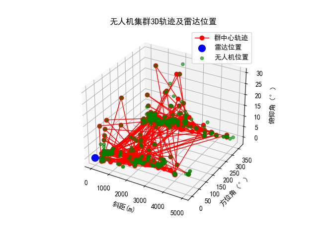

## 项目文件组织
```
uav_tracking_project/
│
├── data/                  # 存放数据
│   ├── train.csv
│   ├── test.csv
│   └── processed/         # 存放处理后的数据
│
├── models/                # 存放训练的模型文件
│   └── model.pkl
│
├── src/
│   ├── __init__.py        # 初始化Python包
│   ├── data_loader.py     # 数据加载模块
│   ├── preprocessing.py   # 数据预处理模块
│   ├── feature_extraction.py # 特征提取模块
│   ├── tracking.py        # 无人机群中心跟踪模块
│   ├── clustering.py      # 群规模估计模块
│   ├── evaluation.py      # 评价指标计算模块
│   ├── model.py           # 模型训练与预测模块
│   └── utils.py           # 一些通用的工具函数
│
├── notebooks/             # 用于探索性分析和实验
│   └── eda.ipynb
│
├── outputs/               # 输出结果文件
│   └── submission.csv
│
├── main.py                # 主程序入口
├── requirements.txt       # 依赖库
└── README.md              # 项目说明

```

## 解决方案
无人机集群目标跟踪中的问题解决方案：

* 航迹反复不连续断批：通过卡尔曼滤波的方式处理了轨迹平滑问题。这将减少由于雷达扫描导致的航迹不连续问题。卡尔曼滤波可以预测下一时刻的位置，并将其与当前位置结合，平滑航迹。

* 群特征不明：通过DBSCAN 聚类算法，能够有效处理含有噪声的点迹数据，并提取群的特征（如群内无人机数量和群中心）。DBSCAN 可以通过自动发现集群中的点迹，帮助提取群特征。

* 断批问题：如果雷达数据中出现部分无人机丢失的情况，可以通过适当的插值技术结合卡尔曼滤波进行航迹补全，减少由于数据丢失导致的航迹断裂。

## 关于特征提取问题
我们仅仅是使用了质心计算和聚类来跟踪群中心和估算规模，那么对你现有的数据，直接使用这些数值（如斜距、方位角、俯仰角）即可。

然而，特征提取是通常在进行机器学习模型训练时的一个重要步骤。如果将来需要训练监督模型（比如通过标签数据进行分类或回归任务），或者需要进一步复杂化的特征工程（例如组合不同特征、提取新的统计特征），那么特征提取就很重要。

是否需要特征提取的判断：

* 如果不需要训练模型：例如，如果仅使用质心和聚类算法进行跟踪和群规模估计，那么可以简化代码，直接使用预处理后的数据，不需要特征提取模块。

* 如果将来需要进一步扩展分析：例如，如果你希望对无人机的运动状态进行分类，或者利用更多的特征组合，那么可以保留特征提取模块。

## 结果分析
### 基线方法


从图片中的可视化结果来看，群中心的轨迹以红色连线显示，反映了无人机集群的整体运动。由于每隔50个轨迹点才显示一次，我们看到的轨迹有明显的起伏，显示出无人机集群在飞行过程中进行较大范围的移动。这些轨迹表明集群的运动不只是局限在某个小区域，可能在进行复杂的机动飞行。轨迹线的上下波动不明显，意味着集群的运动主要发生在水平面上，而在垂直方向上的变化较少。

雷达的位置通过蓝色点标记在图中的原点 `(0, 0, 0)`。通过观察雷达和群中心的轨迹，可以看出无人机集群在雷达的远处进行活动，并且群中心的斜距（距离）和方位角在不断变化。这表明无人机集群的活动范围相对较大，并且在雷达的扫描范围内处于动态的移动过程中。

此外，绿色点展示了集群中每个无人机的位置。由于每隔50个时间点才显示一次，我们可以看到无人机的位置在集群内分布较为稀疏。无人机的分布显得不那么紧密，特别是在某些时刻，个别无人机的位置与群中心的轨迹相距较远。这说明集群内部个体并没有紧密聚集在一起，而是呈现出较为松散的状态。集群的这种分散性可能反映了无人机集群特征不明的问题，特别是在动态环境中，集群的特性和轨迹会显得更加模糊。

整体来看，群中心轨迹的复杂性和无人机位置的稀疏分布反映了你所提到的航迹反复不连续、群特征不明等问题。在每隔50个轨迹点显示的情况下，轨迹线虽然简化了，但仍然清楚地显示出无人机集群在不同时间点的中心位置变化。如果希望捕捉更精细的运动趋势，可以考虑减少步长。此外，使用颜色渐变来表示时间的流逝可能会让轨迹随时间的变化更加直观。

可以进一步分析集群内无人机之间的距离变化，是否有分离或合并的趋势，以帮助理解集群行为。考虑加入不同时间段集群规模的变化展示，以帮助验证群规模估计的正确性。